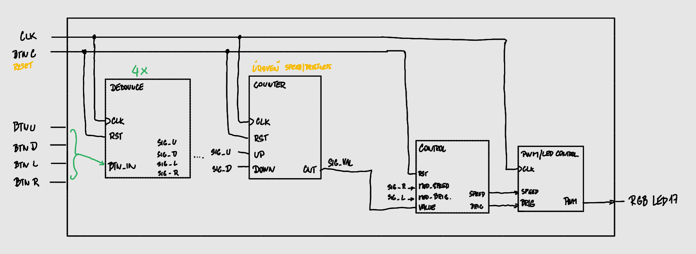

# RGB MOOD LAMP VYTVOŘENÉ NA DESCE NEXYS A7-50T
### Členové týmu
  #### Jakub Dibelka
  * návrh a tvorba programu
  #### Libor Brostík
  * finální dokumentace projektu (README.md) a tvorba programu
  
### Obsah
* [Cíl projektu](#cíl-projektu)

## Cíl projektu
Cílem projektu je návrh a implementace ovladače pro RGB lampu na desce Nexys A7-50T. Lampa umožňuje uživateli měnit parametry lampy pomocí tlačítek na desce
### Základní funkce
* **Výběr barvy:** Možnost přepínat mezi předdefinovanými barvami
* **Úprava svítivosti:** Zvyšení nebo snížení intenzity světla pomocí PWM
* **Úprava rychlosti:** Snižování nebo zvyšování rychlosti pulzování nebo prolínání barev
* **Reset:** Návrat parametrů do původního stavu

## Lab1: Architecture
### Blokové schéma
Návrh blokového schématu pro naší aplikaci (není finální)

### Příprava .XDC souboru
Nastavení pinů desky [Nexys A7-50T](nexys.xdc).
Pro správné propojení kódu VHDL s fyzickým hardwarem desky Nexys A7-50T využijeme constraints soubor (.xdc). V něm namapujeme tyto porty:
#### Tlačítka
* **BTNC:** Tlačítko na reset
* **BTNL:** Přepnutí do režimu nastavení svítivosti (Brightness)
* **BTNR:** Přepnutí do režimu nastavení rychlosti (Speed)
* **BTNU/BTND:** Zvyšování / snižování hodnoty pro dané nastavení
#### RGB
* **LED17_R, LED17_G, LED17_B:** Pro ovládání jednotlivých barev
## Lab2: Unit Design
