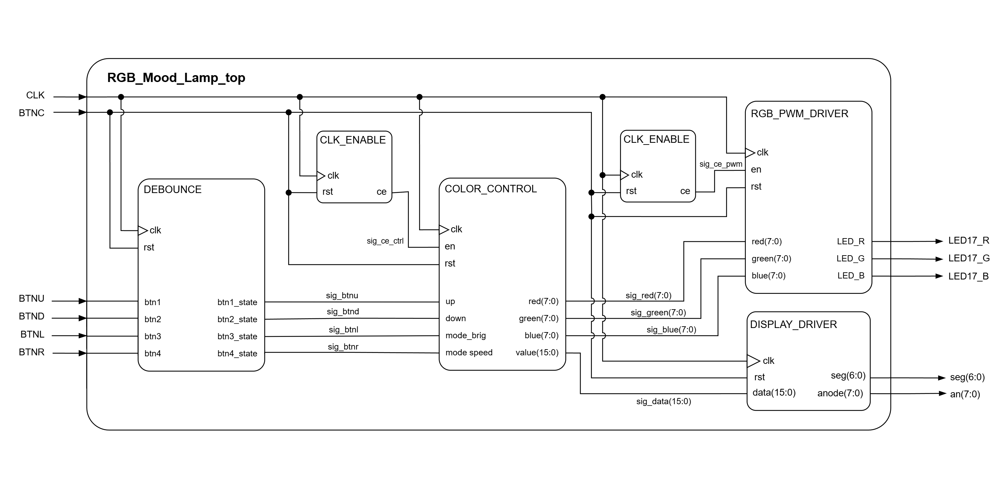
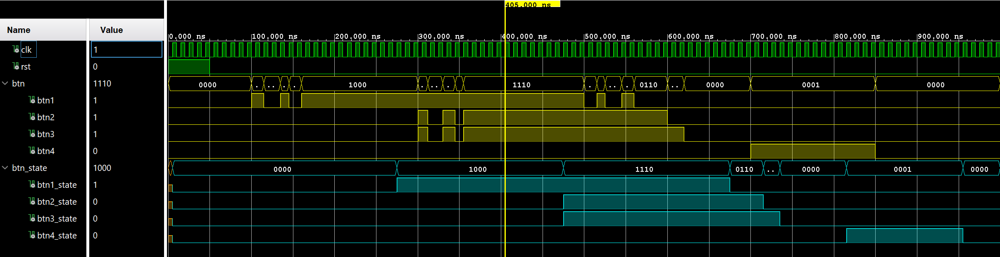

# RGB MOOD LAMP VYTVOŘENÉ NA DESCE NEXYS A7-50T
## Cíl projektu
Cílem projektu je návrh a implementace ovladače pro RGB lampu na desce Nexys A7-50T. Lampa umožňuje uživateli měnit parametry lampy pomocí tlačítek na desce. Aktualní nastavení a jeho hodnoty bude možné sledovat na 7-segmentovém displeji.

### Členové týmu
  #### Jakub Dibelka
  * návrh a tvorba programu
  #### Libor Brostík
  * finální dokumentace projektu (README.md) a tvorba programu

### Základní funkce
* **Výběr barvy:** Možnost přepínat mezi předdefinovanými barvami
* **Úprava svítivosti:** Zvyšení nebo snížení intenzity světla pomocí PWM
* **Úprava rychlosti:** Snižování nebo zvyšování rychlosti pulzování nebo prolínání barev
* **Zobrazení hodnot pomoci 7-segmentového displeje:** Podle nastavení můžeme na displeji sledovat aktualní hodnotu svítivosti/rychlosti
* **Reset:** Návrat parametrů do původního stavu

### Obsah
* [Cíl projektu](#cíl-projektu)
* [Lab1: Architecture](#lab1-architecture)
* [Lab2: Unit Design](#lab2-unit-design)
* [Lab3: Integration](#lab3-integration)
* [Lab4: Tuning](#lab4-tuning)
* [Lab5: Completion](#lab5-completion)
* [Zdrojové soubory](#zdrojové-soubory)
  
## Lab1: Architecture
### Blokové schéma
Návrh blokového schématu pro naší aplikaci

### Příprava .XDC souboru
Pro správné propojení kódu VHDL s fyzickým hardwarem desky [Nexys A7-50T](nexys.xdc) využijeme constraints soubor (.xdc). V něm namapujeme tyto porty:
#### Tlačítka
* **BTNC:** Tlačítko na reset
* **BTNL:** Přepnutí do režimu nastavení svítivosti (Brightness)
* **BTNR:** Přepnutí do režimu nastavení rychlosti (Speed)
* **BTNU/BTND:** Zvyšování / snižování hodnoty pro dané nastavení
#### RGB
* **LED17_R, LED17_G, LED17_B:** Pro ovládání jednotlivých barev
#### RGB
* **SEG:** Zobrazení hodnot pro aktuální nastavení

## Lab2: Unit Design
### Debounce
Mechanická tlačítka při stlačení nebo uvolnění generují sérii rychlých stavových změn (zákmitů). Abychom předešli tomu, že systém vyhodnotí jeden stisk jako několikanásobné zmáčknutí, využíváme modul Debounce. Ten vzorkuje vstupní signál a na výstup propustí stabilní logickou hodnotu až ve chvíli, kdy se vstupní signál ustálí po určitou dobu.

#### &nbsp;&nbsp;&nbsp;  [Debounce VHDL](Program/sources_1/imports/Vivado/debounce_4/debounce_4.srcs/sources_1/imports/new/debounce.vhd)

| Port name | Direction | Type | Description |
| :--- | :---: | :--- | :--- |
| `clk` | in | `std_logic` | Main clock |
| `rst` | in | `std_logic` | High-active synchronous reset |
| `btn1` | in | `std_logic` | Input for button 1 |
| `btn2` | in | `std_logic` | Input for button 2 |
| `btn3` | in | `std_logic` | Input for button 3 |
| `btn4` | in | `std_logic` | Input for button 4 |
| `btn1_state` | out | `std_logic` | State of button 1 |
| `btn2_state` | out | `std_logic` | State of button 2 |
| `btn3_state` | out | `std_logic` | State of button 3 |
| `btn4_state` | out | `std_logic` | State of button 4 |

Pomocí debounce ošetříme 4 tlačítka BTNU, BTND, BTNL a BTNR proti zákmitům.

#### Debounce Testbench

   
  <em><a href="testbenches/debounce_tb.vhd">VHDL Testbench</a></em>

### Color Control
Tento modul tvoří "mozek" celé aplikace. Umožňuje měnit barvu, svítivost a rychlost RGB LED.

#### &nbsp;&nbsp;&nbsp;  [Color Control VHDL](Program/sources_1/imports/Vivado/color_control/color_control.srcs/sources_1/new/color_control.vhd)

| Port name | Direction | Type | Description |
| :--- | :---: | :--- | :--- |
| `clk` | in | `std_logic` | Main clock |
| `en` | in | `std_logic` | Clock enable |
| `rst` | in | `std_logic` | High-active synchronous reset |
| `up` | in | `std_logic` | Increment command from debounced button |
| `down` | in | `std_logic` | Decrement command from debounced button |
| `mode_brig` | in | `std_logic` | Mode selector for brightness adjustment |
| `mode_speed` | in | `std_logic` | Mode selector for speed adjustment |
| `value` | out | `std_logic_vector (15 downto 0)` | Value of speed/brig. for 7-segment driver|
| `red` | out | `std_logic_vector (8 downto 0)` | Calculated Red value for the PWM driver |
| `green` | out | `std_logic_vector (8 downto 0)` | Calculated Green value for the PWM driver |
| `blue` | out | `std_logic_vector (8 downto 0)` | Calculated Blue value for the PWM driver |

#### Color Control Testbench

   
  <em><a href="testbenches/color_fsm_tb.vhd">VHDL Testbench</a></em>

> [!NOTE]
> V simulaci nejsou dobře viditelné stisknutí tlačítek vzhledem k rozsahu simulované doby.

### RGB PWM Driver
Pro ovládání výsledné barvy a svítivosti lampy slouží tento modul. Přijímá číselné hodnoty a převádí je na tři nezávislé signály pulzně šířkové modulace (PWM). Pro PWM modul zadefinujeme tyto I/O porty

#### &nbsp;&nbsp;&nbsp;  [PWM Driver VHDL](Program/sources_1/imports/Vivado/pwm_driver/pwm_driver.srcs/sources_1/new/pwm_driver.vhd)

| Port name | Direction | Type | Description |
| :--- | :---: | :--- | :--- |
| `clk` | in | `std_logic` | Main clock |
| `en` | in | `std_logic` | Clock enable |
| `rst` | in | `std_logic` | High-active synchronous reset |
| `red` | in | `std_logic_vector (7 downto 0)` | Input value determining value for Red LED |
| `green` | in | `std_logic_vector (7 downto 0)` | Input value determining value for Green LED |
| `blue` | in | `std_logic_vector (7 downto 0)` | Input value determining value for Blue LED |
| `led_r` | out | `std_logic` | PWM output signal for the Red LED channel |
| `led_g` | out | `std_logic` | PWM output signal for the Green LED channel |
| `led_b` | out | `std_logic` | PWM output signal for the Blue LED channel |

#### PWM Driver Testbench

   
  <em><a href="testbenches/pwm_driver_tb.vhd">VHDL Testbench</a></em>

## Lab3: Integration
### 7-segment display
&nbsp;&nbsp;&nbsp; Pro lepší přehled nad aktuálním nastavením byl dodatečně přidán modul pro 7-segmentový displej. Díky němu můžeme sledovat aktualní hodnoty dle vybraného nastavení
#### &nbsp;&nbsp;&nbsp; [7-segment VHDL](Program/sources_1/imports/new/display_driver.vhd)

### Top-Level
&nbsp;&nbsp;&nbsp; Je to hlavní entita, která je spojnice mezi programem a hardwarem. V této entitě se inicializují vstupy a výstupy všech modulů.

#### &nbsp;&nbsp;&nbsp;  [Top-Level VHDL](Program/sources_1/RGB_Mood_Lamp_top.vhd)

## Lab4: Tuning
Zaměřili jsme se na ladění kódu, nalezení a následnou opravu chyb a nedostatků programů.

## Lab5: Completion
Dodělávání programů a odstraňování zbývajících nedostatků a kompletace dokumentace (README, poster a video)

### Poster A3
 &nbsp;&nbsp;&nbsp; Poster popisující základní princip programu a funkčnost programu.
  
 &nbsp;&nbsp;&nbsp; [Poster A3](other/poster_v2.pdf)
  
### Video
 &nbsp;&nbsp;&nbsp; Video ukazující funčnost programu na desce Nexys A7 50T
 
 &nbsp;&nbsp;&nbsp; [Video](https://www.youtube.com/watch?v=J7UPF7PQyw4)

## Zdrojové soubory
### Soubor projektu
* [Program RGB Mood Lamp](Program/RGB_Mood_Lamp_top.xpr)
* [Project RGB Mood Lamp (zip)](RGB_Mood_Lamp_top.zip)

### VHDL programy
* [Toplevel RGB Mood Lamp](Program/sources_1/RGB_Mood_Lamp_top.vhd)
* [Color Control](Program/sources_1/imports/Vivado/color_control/color_control.srcs/sources_1/new/color_control.vhd)
* [PWM Driver](Program/sources_1/imports/Vivado/pwm_driver/pwm_driver.srcs/sources_1/new/pwm_driver.vhd)
* [Debounce](Program/sources_1/imports/Vivado/debounce_4/debounce_4.srcs/sources_1/imports/new/debounce.vhd)
* [Clock Enable](Program/sources_1/imports/Vivado/debounce_4/debounce_4.srcs/sources_1/imports/new/clk_en.vhd)
* [Display Driver](Program/sources_1/imports/new/display_driver.vhd)
* [Counter](Program/sources_1/imports/new/counter.vhd)
* [Bin 2 Seg](Program/sources_1/imports/new/bin2seg.vhd)

## Resource Utilization Report ([report](other/Synth Design - synth_1.txt))
Tento projekt byl syntetizován pomocí nástroje **Vivado v.2025.2** pro cílové zařízení **Artix-7** (čip `xc7a50ticsg324-1L`).

### Main Resource Summary

| Resource | Used | Available | Utilization [%] |
| :--- | :---: | :---: | :---: |
| **Slice LUTs** | 207 | 32,600 | 0.63 |
| **Slice Registers** | 144 | 65,200 | 0.22 |
| **Bonded IOB** | 24 | 210 | 11.43 |
| **Global Clock Buffers (BUFG)** | 1 | 32 | 3.13 |

### Design Primitives

Detailní rozpis logických prvků využitých v designu:

| Primitive | Category | Count |
| :--- | :--- | :---: |
| **FDRE** | Flop & Latch (Register) | 132 |
| **LUT4** | Look-Up Table (4-input) | 91 |
| **LUT6** | Look-Up Table (6-input) | 70 |
| **LUT2** | Look-Up Table (2-input) | 52 |
| **CARRY4** | Carry Logic | 42 |
| **LUT5** | Look-Up Table (5-input) | 28 |
| **LUT3** | Look-Up Table (3-input) | 20 |
| **OBUF** | Output Buffer | 18 |
| **LUT1** | Look-Up Table (1-input) | 15 |
| **FDSE** | Flop & Latch (with sync set) | 12 |
| **IBUF** | Input Buffer | 6 |
| **BUFG** | Clock Buffer | 1 |

---
*Generated by Vivado report_utilization on 2026-05-04.*
